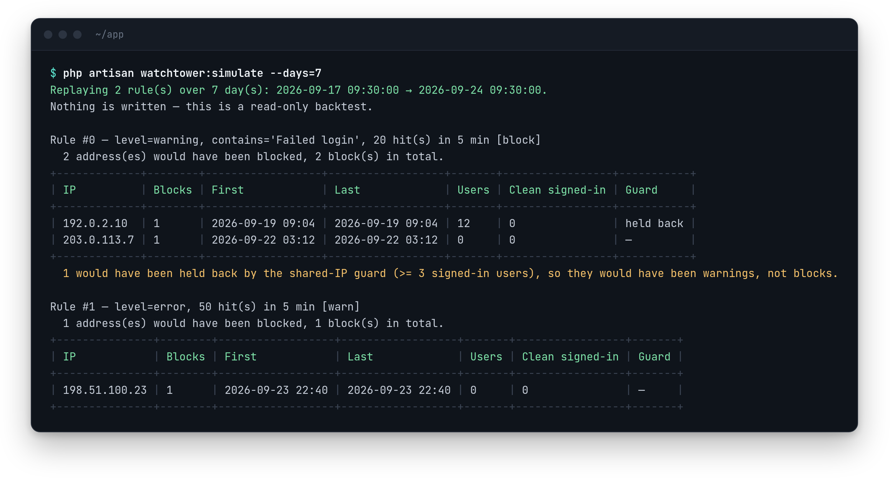

# Watchtower for Laravel

[](LICENSE.md)
[](https://php.net)

**IP blocking for Laravel apps, shared across every environment you run.** Block a bad actor in one place and the rest see it within minutes. It runs on any Laravel cache driver, with no Cloudflare, no WAF and no infrastructure changes.

<p align="center">
  
</p>

<p align="center"><sub><a href="docs/auto-block.md#backtesting-a-rule-before-you-arm-it"><code>watchtower:simulate</code></a> — see what a rule would have blocked last week, before you arm it. Read-only.</sub></p>

## Why Watchtower

- **Fast where it matters.** Every request is checked against your cache before sessions, auth or routing run. The database is never queried per request.
- **One block, every environment.** Production, staging and the rest share one blocklist over signed requests.
- **Automatic blocking that starts as a dry run.** Detectors and log rules report what they *would* block until you arm them, and `watchtower:simulate` backtests a rule against your log history first.
- **Careful with real people.** It won't auto-block an address that many signed-in users share, and you can block an address from your login routes only instead of the whole app.
- **Nothing to build or host.** A management page with no JavaScript and a JSON API. [LogScope](https://github.com/AhmedMerza/laravel-logscope) is optional: with it, log-based rules and `watchtower:simulate` can read your log history.

## Quick Start

**1. Install**

```bash
composer require ahmedmerza/watchtower
php artisan watchtower:install
```

This publishes the config and runs the migration.

**2. Protect yourself first.** Add your own IP to the never-block list before you block anything:

```env
WATCHTOWER_ENABLED=true
WATCHTOWER_NEVER_BLOCK_IPS=127.0.0.1,::1,your.own.ip
```

Nothing can block an address on this list. On IPv6, list your network (`2001:db8:1:2::/64`), not one address: blocking an address blocks its whole `/64`, but a never-block address protects only itself.

**3. Block something.** Open `/watchtower` and use the block form. In the `local` environment the page is open to everyone.

**4. Decide who gets in, before you deploy.** Outside `local`, the page and the [API](docs/api.md) refuse everyone until you define the `viewWatchtower` Gate, the same model as Horizon and Pulse:

```php
// app/Providers/AppServiceProvider.php
use Illuminate\Support\Facades\Gate;

public function boot(): void
{
    Gate::define('viewWatchtower', fn ($user) => in_array($user->email, [
        'admin@example.com',
    ]));
}
```

**With LogScope installed**, the page moves to `/logscope/watchtower` and LogScope's own authorization applies instead of the Gate. LogScope 1.6.1–2.1.x also show a **Block IP** button on each log entry; 2.2.0 removed it.

## How It Works

```
Admin blocks an IP from the management page or the API (staging)
    │
    ├─► DB row created + cache rebuilt → staging protected immediately
    │
    └─► Queued job pushes block to master env
            │
            └─► Every other env pulls from master via watchtower:sync (every 5 min)
                    └─► Cache rebuilt → all environments protected
```

A global middleware checks each request against the cache right after `TrustProxies`. A block can be one IP or a CIDR range. Blocked requests get a plain `403`.

## Features

| Feature | What it does | Docs |
|---|---|---|
| **Management page** | List, filter, block and unblock by hand. No build step, no JavaScript | [Management Page](docs/management-page.md) |
| **JSON API** | Block, unblock, check and list blocks from your own scripts | [Management API](docs/api.md) |
| **Ranges and IPv6** | Block CIDR ranges, and a whole IPv6 `/64` from one address | [Configuration](docs/configuration.md#ip-ranges-and-ipv6) |
| **Cross-environment sync** | A master/satellite setup that shares blocks between environments | [Sync](docs/sync.md) |
| **Attack-tool filter** | Rejects sqlmap, Nikto, WPScan, masscan and zgrab. On by default | [User-Agents](docs/user-agents.md) |
| **Auto-block** | Real-time detectors (failed logins, lockouts, scanner paths, 404 bursts) and rules over your logs | [Auto-Block](docs/auto-block.md) |
| **Backtesting** | `watchtower:simulate` replays a rule over past logs before you arm it | [Backtesting](docs/auto-block.md#backtesting-a-rule-before-you-arm-it) |
| **Shared-IP guard** | Holds back an auto-block on an address several signed-in users share | [Shared IPs](docs/auto-block.md#shared-ips) |
| **Escalating durations** | Longer blocks for addresses that come back | [Escalation](docs/auto-block.md#escalating-durations) |
| **Scoped blocks** | Block an address from some routes, such as login, instead of the whole app | [Scoped Blocks](docs/scoped-blocks.md) |
| **Webhook** | Posts every block to a URL, e.g. for Slack or n8n | [Configuration](docs/configuration.md#webhook-notification) |

All docs: **[docs/](docs/README.md)** · [Configuration](docs/configuration.md) · [Artisan commands](docs/commands.md) · [Security notes](docs/security.md)

## Requirements

- PHP 8.2, 8.3 or 8.4
- Laravel 12 or 13 (Laravel 13 needs PHP 8.3+). Laravel 11 isn't supported: it is past security support, and a current Composer refuses to install it.
- Any Laravel cache store. Redis is recommended for production.
- *Optional:* [ahmedmerza/logscope](https://github.com/AhmedMerza/laravel-logscope) >= 1.6.1, for [log-based auto-block rules](docs/auto-block.md#log-rules) and [backtesting](docs/auto-block.md#backtesting-a-rule-before-you-arm-it). The [detectors](docs/auto-block.md#detectors) work without it. LogScope 1.6.1–2.1.x also show a Block IP button on each log entry.

## Upgrading

Run `php artisan migrate` after every upgrade, then read **[Upgrading](docs/upgrading.md)**. Two changes are easy to miss:

- ⚠️ **Since v0.4.0, auto-block defaults to `warn`**: it reports instead of blocking. Set `WATCHTOWER_AUTO_BLOCK_MODE=block` if you relied on it to block.
- ⚠️ **Since v0.6.0, `GET /api/blocks` is paginated**, so `data` is one page, not the whole list.

## Status

Heading to v1.0. Blocking, sync, the management page and API, and the auto-block engine are in place and tested. Still to come: pushing blocks out to Cloudflare or an nginx deny file, and an importer for `antonioribeiro/firewall` users. See the [roadmap](https://github.com/AhmedMerza/laravel-watchtower/issues/26).

## Security

- **Configure trusted proxies**, or every request looks like it comes from your load balancer.
- **A cache outage fails open**: requests are let through, and the failure is logged about once a minute.
- **Sync requests are HMAC-signed.** The shared secret can block any IP on every environment, so treat it as a credential.

Details: [Security Notes](docs/security.md).

## Contributing

Contributions are welcome. Please open an issue or submit a pull request on [GitHub](https://github.com/AhmedMerza/laravel-watchtower).

## License

MIT License. See [LICENSE](LICENSE.md) for details.
